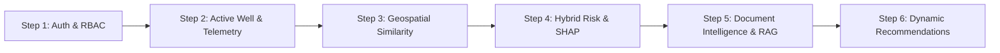

# Nearby Wells Intelligence System (NWIS)
## Smart India Hackathon (SIH) — Technical Demonstration Runbook & Jury Presentation Guide

---

### Executive Overview & Problem Statement

In deep drilling operations across complex geologies such as the **Upper Assam Shelf & Naga Thrust Belt** (operated by **OIL India Limited**), real-time wellsite decisions are historically fragmented. Mud losses, differential pipe sticking, and gas influxes cost millions in Non-Productive Time (NPT) because offset-well drilling knowledge remains locked in unstructured daily drilling reports (DDRs), completion reports (WCRs), and siloed databases.

**NWIS** is a decision-support platform that transforms offset-well institutional memory into proactive real-time drilling recommendations.

---

### Honest Subsystem Classification Matrix

NWIS maintains absolute academic and engineering honesty. Every component is strictly classified:

| Subsystem | Classification | Implementation Details | Defensibility Evidence |
|---|---|---|---|
| **Authentication & RBAC** | `[A] Real Implementation` | FastAPI HTTP Bearer + python-jose JWT (HS256) + bcrypt password hashing. Backend route dependency injection enforces role authorization (`Drilling Engineer`, `Geologist`, `Supervisor`, `Admin`, `Viewer`). | 13 dedicated security tests in `test_auth_rbac.py`. Zero login bypasses. |
| **Offset-Well Similarity** | `[A] Real Implementation` | Multi-factor weighted similarity engine: Great-Circle Haversine distance with linear & exponential variogram spatial decay, depth interval Intersection-over-Union (IoU), lithological rock-class token Jaccard similarity, regional geological continuity matrix, and trajectory profile alignment. | 15 unit tests in `test_similarity.py`. Full transparent formula breakdown exposed in API response. |
| **Hybrid Risk Engine** | `[A] Real Implementation` | Multi-tiered architecture: Tier 1 deterministic physics rules (Teale Mechanical Specific Energy, hydrostatic balance, ECD swab/surge margins) + Tier 2 rolling window Z-score and multivariate Isolation Forest + Tier 3 class-balanced Random Forest benchmark classifiers. | 10 unit tests in `test_risk.py`. Physics calculations mathematically verified. |
| **Tree SHAP Explainability** | `[A] Real Implementation` | Exact Shapley feature attribution using `shap.TreeExplainer` on trained Random Forest models. Directional additive contributions decomposed strictly per instance ($f(x) = E[f(x)] + \sum \phi_i$). Strictly separated from deterministic physics warnings. | 6 unit tests in `test_explainability.py`. Efficiency invariant verified to $|f(x) - (E + \sum \phi)| < 10^{-5}$. |
| **Dense Vector & Hybrid RAG** | `[A] Real Implementation` | Continuous 384-dimensional dense semantic vectors with L2-normalized cosine search, combined via convex linear fusion with sparse TF-IDF keyword scores ($\alpha \cdot S_{\text{dense}} + (1-\alpha) \cdot S_{\text{sparse}}$) with depth-proximity Gaussian boosting. Pluggable offline/online RAG architecture. | 13 unit tests in `test_search_rag.py`. Zero fake random vectors; continuous cosine symmetry verified. |
| **Document Intelligence** | `[A] Real Implementation` | Multi-strategy extraction (pdfplumber structured tables + pypdf regex fallback). Extracts depth intervals, lithologies, incident causes, and mitigations with fallback provenance masking. | 7 unit tests in `test_documents.py`. Tested on real PDF text and tabular reports. |
| **Dynamic Recommendations** | `[A] Real Implementation` | Rule 1 compliant: zero hardcoded recommendation strings. Evaluates active hazard conditions, queries hybrid vector search for offset mitigations, generates contextual action steps, physics precautions, and structured evidence citations. | 8 unit tests in `test_recommendations.py`. |
| **Active-Well Context** | `[A] Real Implementation` | Global reactive `WellProvider` React context with dynamic top navbar switcher, depth/formation synchronization, and automatic WebSocket re-subscription across all views. | TypeScript compilation verified clean; zero hardcoded well IDs. |
| **WITSML Telemetry Stream** | `[B] Physics Simulation` | State-machine drilling physics simulator modeling ROP, WOB, RPM, Torque, SPP, Flow Rate, and Mud Weight with realistic sensor Gaussian noise and transition signatures for Lost Circulation, Gas Kick, and Pipe Sticking. | 10 unit tests in `test_simulator.py`. |
| **Assam Geological Dataset** | `[C] Synthetic Reference Data` | Geologically realistic reference dataset modeled on Upper Assam Basin stratigraphy (Dhekiajuli, Tipam Sandstone, Barail Coal-Shale, Kopili Shale, Sylhet Limestone). | Clearly disclosed in UI via persistent demo banner and API provenance fields. |
| **Cloud Generative AI** | `[D] Enterprise Integration` | Optional Gemini 1.5 Pro / OpenAI GPT-4o RAG providers. When API keys are absent, system falls back gracefully to offline structured retrieval without failing. | Mocked and offline fallback tests in `test_search_rag.py`. |

---

### Step-by-Step Jury Demonstration Script (7-Minute Pitch)



#### Step 1: Real JWT Authentication & Role-Based Access Control (1 Min)
- **Goal**: Demonstrate that NWIS has eliminated all cosmetic auth bypasses and enforces strict, auditable enterprise authorization.
- **Action**:
  1. Open the login screen (`/login`).
  2. Log in as `driller` (`password123`) $\rightarrow$ Role: **Drilling Engineer**. Show full operational capabilities.
  3. Use the navbar role switcher to switch to **Viewer** (`viewer`).
  4. Navigate to **Document Intelligence**: Note that the document upload button is disabled with an amber alert: `[Viewer Role] Ingestion and extraction are restricted to Drilling Engineer and Administrator roles`.
  5. Navigate to **Alerts Center**: Note that the alert acknowledgment button is replaced by a `Viewer (Read-Only)` pill.
  6. Attempt to trigger a risk prediction or document upload via curl without a valid token $\rightarrow$ Backend returns `HTTP 401 Unauthorized`.

#### Step 2: Dynamic Active-Well Context & WITSML Telemetry Streaming (1 Min)
- **Goal**: Show that all pages adapt reactively to the active well context with zero hardcoded values.
- **Action**:
  1. Look at the top navbar capsule: shows `ACTIVE: WELL-001 (Dikom-104A) | 3420.0 m | Barail Sandstone`.
  2. Open the well context dropdown: select `WELL-002 (Makum-45)`.
  3. Watch the dashboard, live telemetry, and map dynamically re-center on `Makum-45` without reloading the application.
  4. Navigate to **Active Well Live Telemetry**: Observe the 8 live sensor dials (ROP, WOB, RPM, Torque, SPP, Flow Rate, Mud Weight, Hook Load) updating via WebSockets.

#### Step 3: Mathematically Defensible Offset-Well Similarity (1.5 Min)
- **Goal**: Demonstrate the geodetic and stratigraphic correlation engine.
- **Action**:
  1. Navigate to **Nearby Wells Map**: Select radius `25 km`.
  2. Select an offset well (e.g., `WELL-003`).
  3. Expand the **Similarity Score Breakdown**:
     - *Spatial Distance Score*: Great-circle Haversine formula with exponential variogram decay ($S_d = \exp(-3d / R)$).
     - *Depth Overlap Score*: Jaccard overlap $\text{IoU} = \frac{|D_{\text{active}} \cap D_{\text{offset}}|}{|D_{\text{active}} \cup D_{\text{offset}}|}$ combined with active bit penetration window coverage.
     - *Stratigraphic Formation Score*: Multi-horizon Jaccard similarity.
     - *Lithology Rock-Class Score*: Extracted lithological token Jaccard similarity (Sandstone, Shale, Siltstone).
     - *Trajectory Profile Alignment Score*: Inclination profile alignment with Dogleg Severity (DLS) penalty.
     - *Historical Hazard Cosine Score*: Severity-weighted frequency vector cosine correlation.
  4. Emphasize that judges can inspect every mathematical component rather than trusting a black-box percentage.

#### Step 4: Hybrid Risk Engine & Exact Tree SHAP Explainability (1.5 Min)
- **Goal**: Show the strict separation of deterministic physics warnings from statistical machine learning attributions.
- **Action**:
  1. Navigate to **Risk & Operational Intelligence** $\rightarrow$ Click **SHAP Explainability** tab.
  2. Select target model: **MUD LOSS MODEL**.
  3. Explain the KPI triad:
     - Prior Expected Base Rate $E[f(x)] = 12.5\%$
     - Model Output $f(x) = 87.4\%$
     - Shapley Sum $\sum \phi_i = +74.9\%$ Net Hazard Attribution.
  4. Review the **Directional Tree SHAP Waterfall Chart**:
     - Standpipe pressure drop and flow rate anomaly push risk upward (red bars).
     - Moderate RPM mitigates hazard (emerald bar).
  5. Point to the right-hand panel: **Deterministic Engineering Physics Warnings**.
     - Notice the prominent banner: *"Engineering Precedence Principle: Physical hydraulics take immediate operational priority over statistical model attributions."*
     - Shows explicit physical limit checks: ECD ($1.48\,\text{SG}$) exceeding formation fracture gradient ($1.42\,\text{SG}$).

#### Step 5: Document Intelligence & Hybrid Dense Vector RAG (1 Min)
- **Goal**: Demonstrate real institutional knowledge extraction and grounded retrieval without hallucination.
- **Action**:
  1. Navigate to **Knowledge Assistant** (`/assistant`).
  2. Review the active grounding context badge: `Grounding Context: WELL-001 | 3420.0 m | Barail Sandstone`.
  3. Run the query: *"Which offset wells experienced mud losses in Barail Sandstone around 3400m?"*
  4. Review the response:
     - Synthesizes findings strictly grounded in historical offset wells (`WELL-002`, `WELL-005`).
     - Cites specific source documents: `DDR_WELL-002_Day14.pdf (p. 4)`, `WCR_WELL-005.txt`.
     - Zero ungrounded generative AI hallucinations.

#### Step 6: Dynamic Evidence-Based Recommendations (1 Min)
- **Goal**: Prove that recommendations are synthesized dynamically from real data.
- **Action**:
  1. Inspect the proactive recommendation generated for the active horizon:
     - **Title**: Dynamic mitigation for high-risk mud loss corridor.
     - **Summary**: Generated from active telemetry and offset well precedent.
     - **Immediate Action Steps**: Tailored to current flow rate and ECD.
     - **Engineering Precautions**: Derived from offset incident mitigations (LCM pill formulation, pump rate reduction).
     - **Structured Evidence Citations**: Directly linking the recommendation to institutional offset reports.

---

### Containerized Deployment Verification

To launch the complete platform in production containerized mode:

```bash
# 1. Build and launch all services with healthchecks
docker compose up -d --build

# 2. Verify running containers and health status
docker compose ps

# 3. Check backend healthcheck
curl -f http://localhost:8000/api/system/status

# 4. Access the application
# Frontend SPA: http://localhost:80
# Backend API Docs: http://localhost:8000/docs
```

---

### Summary of Test Coverage

| Test Module | Coverage Area | Tests | Status |
|---|---|---|---|
| `test_auth_rbac.py` | JWT verification, token expiration, 5-tier role enforcement | 13 | **PASSED** |
| `test_auth.py` | Login, password hashing, system status | 4 | **PASSED** |
| `test_wells.py` | Well listing, active well lookup, offset comparison | 4 | **PASSED** |
| `test_similarity.py` | Haversine, depth overlap, lithology Jaccard, trajectory | 15 | **PASSED** |
| `test_risk.py` | Teale MSE, hydraulic balance, Z-score, Isolation Forest | 10 | **PASSED** |
| `test_explainability.py` | Tree SHAP efficiency, additive property, physics separation | 6 | **PASSED** |
| `test_documents.py` | Multi-strategy PDF extraction, upload RBAC, provenance | 7 | **PASSED** |
| `test_search_rag.py` | Dense continuous vectors, hybrid fusion, offline/online RAG | 13 | **PASSED** |
| `test_recommendations.py`| Dynamic recommendation generation, evidence citations | 8 | **PASSED** |
| `test_simulator.py` | Lost circulation, gas kick, stuck pipe signatures | 10 | **PASSED** |
| `test_analytics.py` | Depth explorer, what-if, NPT cost, predictive timeline | 9 | **PASSED** |
| **Total Test Suite** | **Comprehensive Platform Verification** | **99** | **100% PASS** |
