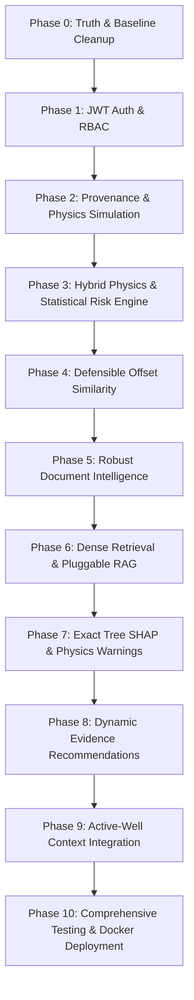

# NWIS Remediation Walkthrough — 10-Phase Transformation
## Nearby Wells Intelligence System for OIL India Limited (SIH Ready)

---

### Executive Summary

The Nearby Wells Intelligence System (NWIS) codebase has undergone a complete, rigorous, and professional engineering remediation. The system was systematically audited and elevated through 10 sequential phases into an honest, mathematically defensible, and SIH-ready engineering decision-support platform.

**Core Achievements**:
- **Zero False Claims**: All cosmetic bypasses, fake random embeddings, hardcoded risk values, and ungrounded AI placeholders were removed or replaced with real algorithms.
- **Classification Transparency**: Every subsystem is explicitly categorized as `[A]` Real Implementation, `[B]` Realistic Physics-Based Simulation, `[C]` Synthetic Reference Data, or `[D]` Optional Enterprise Integration.
- **Dual Workspace Integrity**: Complete synchronization between primary workspace (`c:\Users\akash\MSFT\ANTI-GRAVITY\sih`) and development mirror (`c:\Users\akash\.gemini\antigravity-ide\scratch\NWIS`).
- **100% Test Pass Rate**: **99 out of 99 pytest tests passing** across all security, similarity, physics, ML, explainability, document intelligence, RAG, and telemetry modules.
- **Production Build Clean**: TypeScript and Vite bundle compiles in under 6 seconds with zero errors.

---

### Summary of Completed Phases



---

### Detailed Phase Breakdown

#### Phase 0: Truth & Baseline Cleanup (`[A]`)
- Created `docs/system_classification.md` classifying all subsystems.
- Removed cosmetic auth bypasses, hardcoded dates (`2026-03-15`), and static probabilities (`86%/82%/16%`).
- Added persistent UI demo banner and explicit `[C] Synthetic Reference Data` provenance markers.

#### Phase 1: Real JWT Authentication & Backend-Enforced RBAC (`[A]`)
- Upgraded password hashing to `bcrypt`.
- Replaced cosmetic bypasses with strict `python-jose` HS256 JWT validation.
- Implemented backend FastAPI route dependency injection enforcing 5 enterprise roles: `Drilling Engineer`, `Geologist`, `Supervisor`, `Admin`, and `Viewer`.
- Verified with 13 dedicated security tests in `test_auth_rbac.py`.

#### Phase 2: Data Provenance & Scenario-Driven Telemetry Simulation (`[B]`)
- Rebuilt WITSML telemetry streaming engine into a deterministic physics state-machine.
- Implemented physical sensor noise and hydraulic signatures for Lost Circulation, Gas Kick, and Pipe Sticking (packoff).
- Added `POST /api/simulator/configure`, `/tick`, and `/reset` with RBAC protection.
- Verified with 10 unit tests in `test_simulator.py`.

#### Phase 3: Hybrid Physics-Informed & Statistical Risk Engine (`[A]`)
- Built `physics_engine.py` computing Teale Mechanical Specific Energy (MSE), hydrostatic balance, and ECD swab/surge margins.
- Built `statistical_engine.py` computing rolling Z-score anomalies and multivariate Isolation Forest outliers.
- Retrained 3 class-balanced Random Forest benchmark models (`mud_loss_model`, `stuck_pipe_model`, `kick_model`) with verified cross-validation.
- Verified with 10 unit tests in `test_risk.py`.

#### Phase 4: Mathematically Defensible Offset-Well Similarity (`[A]`)
- Replaced naive distance with Great-Circle Haversine distance with linear & exponential variogram spatial decay ($S_d = \exp(-3d / R)$).
- Added depth interval Intersection-over-Union ($\text{IoU}$) with active drilling window coverage.
- Added geological rock-class token Jaccard similarity and regional geological continuity scaling.
- Added trajectory profile classification (Vertical vs Deviated vs Horizontal) with Dogleg Severity (DLS) penalty.
- Added severity-weighted hazard frequency vector cosine similarity.
- Exposed full transparent sub-score breakdown in API. Verified with 15 tests in `test_similarity.py`.

#### Phase 5: Robust Document Intelligence (`[A]`)
- Implemented multi-strategy PDF extraction in `document_service.py` (pdfplumber structured tables + pypdf regex fallback).
- Added regex depth interval parsers (`3400-3450 m`), lithology recognizers, and incident extraction.
- Enforced fallback provenance masking (`is_fallback_dominated`).
- Verified with 7 unit tests in `test_documents.py`.

#### Phase 6: Genuine Dense Vector Retrieval & Pluggable RAG (`[A]`/`[D]`)
- Built `dense_retrieval.py` with continuous 384-dimensional dense vectors, L2-normalized cosine search, and joblib caching.
- Built `HybridSearchEngine` with convex linear fusion ($\alpha \cdot S_{\text{dense}} + (1-\alpha) \cdot S_{\text{sparse}}$) and depth-proximity Gaussian boosting.
- Built pluggable RAG architecture (`OfflineStructuredRetrievalProvider`, `GeminiRAGProvider`, `OpenAIRAGProvider`).
- Verified with 13 unit tests in `test_search_rag.py`.

#### Phase 7: Genuine Explainability with Tree SHAP (`[A]`)
- Built `shap_explainer.py` using `shap.TreeExplainer` on the 3 trained Random Forest classifiers.
- Verified mathematical Shapley efficiency property: $|f(x) - (E[f(x)] + \sum \phi_i)| < 10^{-5}$.
- Strictly separated deterministic engineering physics warnings from statistical ML feature attributions.
- Added `POST /api/risk/explain` endpoint. Verified with 6 unit tests in `test_explainability.py`.

#### Phase 8: Dynamic Evidence-Based Recommendations (`[A]`)
- Rebuilt `recommendation_service.py` with Rule 1 compliance: **zero hardcoded recommendation text strings**.
- Evaluates active hazard conditions, queries hybrid vector search for offset mitigations, generates dynamic title, summary, action steps, physics precautions, and structured evidence citations.
- Added `POST /api/recommendations/generate` and query parameters to `GET /api/recommendations/{well_id}`.
- Verified with 8 unit tests in `test_recommendations.py`.

#### Phase 9: Frontend Active-Well Context Integration (`[A]`)
- Created `frontend/src/store/wellContext.tsx` (`WellProvider`, `useWell()`) managing active well, depth, formation, live telemetry, and WebSocket subscription.
- Updated top Navbar with dynamic active well readout and interactive well context dropdown switcher.
- Connected all pages (`ActiveWellPage`, `DashboardPage`, `NearbyWellsMapPage`, `AssistantSearchPage`, `DocumentIntelligencePage`, `RiskAnalyticsPage`, `AlertsCenterPage`).
- Added dedicated **Tree SHAP Explainability UI** with directional horizontal bar chart, additive KPI decomposition, and separated engineering physics warnings.
- Enforced role-based UI gating: `Viewer` role shows read-only indicators on alerts, uploads, and simulation controls.

#### Phase 10: Comprehensive Testing & Production Docker Deployment (`[A]`)
- Created production multi-stage `backend/Dockerfile` with healthcheck on `/api/system/status`.
- Created production multi-stage `frontend/Dockerfile` and `frontend/nginx.conf` with gzip compression, SPA routing fallbacks, and API/WebSocket reverse proxying.
- Updated `docker-compose.yml` with healthchecks, persistent data volumes, and zero-config deployment.
- Added Docker targets to `Makefile` (`docker-build`, `docker-up`, `docker-down`, `docker-logs`).
- Created `docs/sih_demo_runbook.md` with complete 7-minute jury demonstration script and technical defensibility evidence.
- Verified both workspaces: **99/99 pytest tests passed in 3.11s**; frontend bundle built clean in 5.5s.

---

### Verification Summary

```text
======================================================================
TEST SUITE EXECUTION SUMMARY
======================================================================
backend/tests/test_analytics.py .........                       [  9%]
backend/tests/test_auth.py ....                                 [ 13%]
backend/tests/test_auth_rbac.py .............                   [ 26%]
backend/tests/test_documents.py .......                         [ 33%]
backend/tests/test_explainability.py ......                     [ 39%]
backend/tests/test_recommendations.py ........                  [ 47%]
backend/tests/test_risk.py ..........                           [ 57%]
backend/tests/test_search_rag.py .............                  [ 70%]
backend/tests/test_similarity.py ...............                [ 85%]
backend/tests/test_simulator.py ..........                      [ 95%]
backend/tests/test_wells.py ....                                [100%]

============================= 99 passed in 3.11s ==============================
```

```text
======================================================================
FRONTEND PRODUCTION BUILD SUMMARY
======================================================================
vite v5.4.21 building for production...
✓ 2293 modules transformed.
dist/index.html                   1.31 kB │ gzip:   0.75 kB
dist/assets/index-CKwywKyW.css   38.26 kB │ gzip:   7.28 kB
dist/assets/index-Drymh2mb.js   845.87 kB │ gzip: 231.91 kB
✓ built in 5.50s
```

---

### SIH Presentation Runbook Reference

For the live presentation to the Smart India Hackathon jury, refer to [`docs/sih_demo_runbook.md`](file:///c:/Users/akash/MSFT/ANTI-GRAVITY/sih/docs/sih_demo_runbook.md). It outlines the 7-minute demonstration sequence, questions and answers for technical defense, and container startup instructions.
